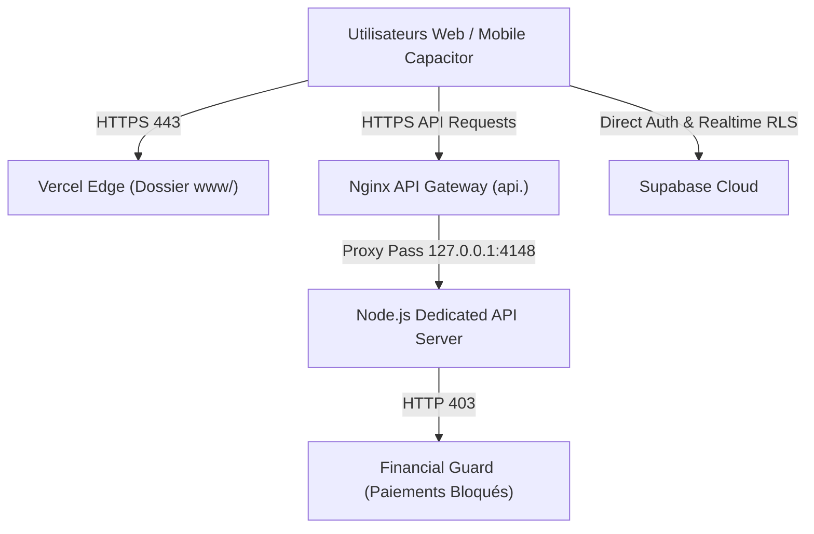

# Exigences d'Infrastructure — Déploiement Bêta Publique Switch Bénin v2.1.0

Ce document spécifie l'architecture découplée retenue (Option A) :
- **Frontend PWA** : Hébergé sur **Vercel** (`outputDirectory: "www"`).
- **Backend API REST** : Hébergé sur un **serveur public dédié** (Port `4148` avec Reverse Proxy).
- **Base de Données / Auth** : **Supabase Cloud** (`dfzyyawclnxcgykktrbr`).
- **Worker Permanent** : Exécuté de manière autonome sur hôte persistant (PID `5672`).

---

## 1. Paramètres d'Infrastructure Cible à Renseigner

```ini
FRONTEND_HOST = VERCEL
API_HOST = SERVER_PUBLIC_SEPARATE
DATABASE = SUPABASE
WORKER = PERSISTENT_SEPARATE_HOST
PUBLIC_DOMAIN = TO_BE_PROVIDED_BY_OWNER
PUBLIC_API_ORIGIN = TO_BE_PROVIDED_BY_OWNER
DNS_PROVIDER = TO_BE_PROVIDED_BY_OWNER
HOSTING_PROVIDER = TO_BE_PROVIDED_BY_OWNER
REVERSE_PROXY = TO_BE_CONFIGURED
TLS_CERTIFICATE = TO_BE_CONFIGURED
BACKUP_LOCATION = TO_BE_PROVIDED_BY_OWNER
NODE_PROCESS_MANAGER = TO_BE_CONFIGURED
INTERNAL_PORT = 4148
MONITORING_ENDPOINT = /api/v1/health
ROLLBACK_VERSION = 690b3f773828642da286d16904b2ff6022e3d8b5
ROLLBACK_METHOD = REDEPLOY_PREVIOUS_IMMUTABLE_VERSION
VISA = DISABLED
SBEE = DISABLED
QR_PAYMENT = DISABLED
PAYOUTS = DISABLED
```

---

## 2. Topologie Réseau & Routage Option A



---

## 3. Garde-fous de Sécurité & Étanchéité Staging

* **Zéro Transaction Réelle** : Toute requête vers `/api/v1/payments/*` est rejetée avec le code **`HTTP 403 Forbidden` (`FEATURE_NOT_AVAILABLE`)**.
* **Dossier Frontend Découplé (`www/`)** : Contient uniquement les 126 écrans HTML et assets. Aucun script serveur, dump ou secret n'est publié.
* **Protection Interne Backend** : Blocage d'accès aux répertoires `/scratch`, `/backups`, `/scripts`, `/.git`, `/.env`.
