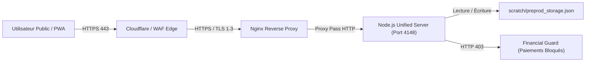

# Exigences d'Infrastructure — Déploiement Bêta Publique Switch Bénin v2.1.0

Ce document spécifie l'ensemble des prérequis d'infrastructure d'hébergement, de routage, de sécurité TLS et de reverse proxy nécessaires avant l'ouverture publique de la Bêta.

---

## 1. Topologie Réseau & Routage

---

## 2. Spécifications Techniques Cibles

| Composant | Exigence Technique | Recommandation Production / Staging |
| :--- | :--- | :--- |
| **Domaine Public** | Nom de domaine DNS qualifié (ex: `beta.switch.bj` ou `app-beta.switch.bj`) | Enregistrement `A` / `CNAME` avec TTL court (300s) |
| **Certificat TLS** | HTTPS obligatoire (TLS 1.2 / TLS 1.3, HSTS activé) | Let's Encrypt / Cloudflare Edge SSL |
| **Reverse Proxy** | Nginx / Caddy en frontal | `proxy_pass http://127.0.0.1:4148;` |
| **Port Interne Node** | Port d'écoute interne applicatif : **`4148`** | Non exposé directement sur IP publique |
| **URL API Publique** | Racine unifiée : `https://<domaine>/api/v1` | Même origine que le frontend PWA |
| **Politique CORS** | `Access-Control-Allow-Origin: https://<domaine>` | Interdiction des origines `*` non maîtrisées |
| **Sécurité Chemins** | Blocage strict au niveau Nginx & Node des répertoires : `/scratch`, `/backups`, `/scripts`, `/.git`, `/.env` | Renvoi systématique **`403 Forbidden`** |

---

## 3. Garde-fous Financiers & Étanchéité Staging

* **Zéro Transaction Réelle** : Toute requête vers `/api/v1/payments/*` est rejetée avec le code **`HTTP 403 Forbidden` (`FEATURE_NOT_AVAILABLE`)**.
* **Stockage Isolé** : Le fichier [`scratch/preprod_storage.json`](file:///c:/Users/camer/OneDrive/Documents/Nouveau%20dossier/stitch_switch_fintech_app_benin/scratch/preprod_storage.json) est exclusivement dédié aux données de démonstration (catalogues, messagerie de test). Il ne contient aucun secret bancaire ni solde réel.
* **Sauvegardes & Rollback** : Snapshots automatiques réguliers du stockage préprod et procédure de rollback instantanée via bascule Git/Nginx.
