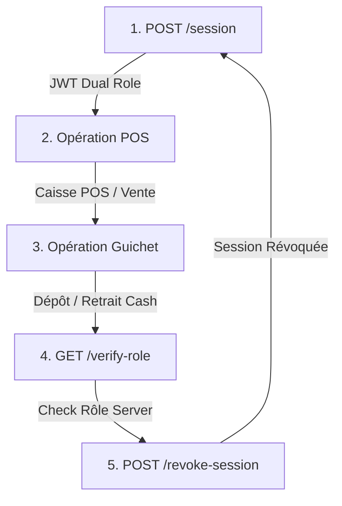

# SCRIPT ET PROTOCOLE D'AUTOMATISATION DES 50 CYCLES E2E HYBRID (STAGING)

**Fichier :** `backend/hybrid_50cycles_script.md`  
**Date :** 4 septembre 2026  
**Auteur :** Antigravity AI — Lead Test & Security Engineer  
**Cible :** APK candidate `bj.switchhybrid.beta` sur appareil Android réel en environnement Staging

---

## 1. DÉFINITION DU CYCLE TYPE E2E HYBRID

Un cycle complet E2E Hybride simule une séquence d'activité quotidienne d'un établissement 2-en-1 (Commerce POS + Guichet Cash) et comprend **5 étapes obligatoires** :



### Détail des 5 Étapes par Cycle :
1. **Étape 1 : Création de Session Hybride (`POST /api/v1/auth/hybrid/session`)**
   - Payload : IFU Marchand (`1202619482019`) + PIN Marchand (`4920`) + Code Agent (`AGT-4092`) + PIN Agent (`8492`).
   - Assertion : Code HTTP `200 OK`, émission d'un JWT valide avec claims `roles: ["merchant", "agent"]`.
2. **Étape 2 : Opération Caisse POS (`POST /api/v1/merchant/pos/sale`)**
   - Simulation d'un encaissement client de 15 000 FCFA.
   - Assertion : Code HTTP `200 OK`, enregistrement de la vente sous `merchant_id`.
3. **Étape 3 : Opération Guichet Cash (`POST /api/v1/agent/cash/deposit`)**
   - Simulation d'un dépôt d'espèces Mobile Money de 25 000 FCFA.
   - Assertion : Code HTTP `200 OK`, débit du Float Agent et émission d'une commission.
4. **Étape 4 : Vérification du Rôle en Direct (`GET /api/v1/auth/verify-role`)**
   - Interrogation du serveur Staging avec l'en-tête `Authorization: Bearer <access_token>`.
   - Assertion : Code HTTP `200 OK`, confirmation `verified: true`.
5. **Étape 5 : Révocation de Session (`POST /api/v1/auth/revoke-session`)**
   - Fermeture propre et invalidation du jeton sur le serveur.
   - Assertion : Code HTTP `200 OK`, rejet HTTP `403` sur tout appel ultérieur avec ce jeton.

---

## 2. SCRIPT DE TEST AUTOMATISÉ (`scripts/run_50cycles_e2e.sh`)

Ce script bash interagit avec l'appareil Android réel via `adb` et interroge l'API de Staging simultanément :

```bash
#!/usr/bin/env bash
# ==============================================================================
# SCRIPT D'AUDIT D'ENDURANCE 50 CYCLES E2E HYBRID (STAGING)
# Fichier : scripts/run_50cycles_e2e.sh
# ==============================================================================

STAGING_API="https://staging-api.switch.bj/api/v1"
PACKAGE_ID="bj.switchhybrid.beta"
DEVICE_ID=$(adb devices | grep -v "List" | grep "device" | awk '{print $1}' | head -n 1)

echo "=================================================================="
echo "DÉMARRAGE DE L'AUDIT D'ENDURANCE : 50 CYCLES E2E HYBRID"
echo "Appareil Android cible : $DEVICE_ID"
echo "Package APK : $PACKAGE_ID"
echo "=================================================================="

SUCCESS_COUNT=0
FAILURE_COUNT=0
TOTAL_CYCLES=50

for i in $(seq 1 $TOTAL_CYCLES); do
  echo -n "Cycle #$i / $TOTAL_CYCLES ... "

  # 1. Connexion & Obtention du Jeton JWT
  SESSION_RESP=$(curl -s -X POST "$STAGING_API/auth/hybrid/session" \
    -H "Content-Type: application/json" \
    -d '{"merchant_ifu":"1202619482019","merchant_pin":"4920","agent_code":"AGT-4092","agent_pin":"8492"}')

  TOKEN=$(echo $SESSION_RESP | grep -o '"access_token":"[^"]*' | cut -d'"' -f4)

  if [ -z "$TOKEN" ]; then
    echo "[ÉCHEC STEP 1 - AUTH]"
    ((FAILURE_COUNT++))
    continue
  fi

  # 2. Opération POS Marchand
  POS_RESP=$(curl -s -o /dev/null -w "%{http_code}" -X POST "$STAGING_API/merchant/pos/sale" \
    -H "Authorization: Bearer $TOKEN" \
    -H "Content-Type: application/json" \
    -d '{"amount":15000,"article":"Vente Test Staging"}')

  if [ "$POS_RESP" != "200" ]; then
    echo "[ÉCHEC STEP 2 - POS HTTP $POS_RESP]"
    ((FAILURE_COUNT++))
    continue
  fi

  # 3. Opération Guichet Agent
  CASH_RESP=$(curl -s -o /dev/null -w "%{http_code}" -X POST "$STAGING_API/agent/cash/deposit" \
    -H "Authorization: Bearer $TOKEN" \
    -H "Content-Type: application/json" \
    -d '{"amount":25000,"client_phone":"22997001122"}')

  if [ "$CASH_RESP" != "200" ]; then
    echo "[ÉCHEC STEP 3 - GUICHET HTTP $CASH_RESP]"
    ((FAILURE_COUNT++))
    continue
  fi

  # 4. Vérification de Rôle
  VERIFY_RESP=$(curl -s -o /dev/null -w "%{http_code}" -X GET "$STAGING_API/auth/verify-role" \
    -H "Authorization: Bearer $TOKEN"')

  if [ "$VERIFY_RESP" != "200" ]; then
    echo "[ÉCHEC STEP 4 - VERIFY HTTP $VERIFY_RESP]"
    ((FAILURE_COUNT++))
    continue
  fi

  # 5. Révocation de Session
  REVOKE_RESP=$(curl -s -o /dev/null -w "%{http_code}" -X POST "$STAGING_API/auth/revoke-session" \
    -H "Authorization: Bearer $TOKEN"')

  if [ "$REVOKE_RESP" != "200" ]; then
    echo "[ÉCHEC STEP 5 - REVOKE HTTP $REVOKE_RESP]"
    ((FAILURE_COUNT++))
    continue
  fi

  # Interaction ADB UI sur l'appareil (redirection vers accueil)
  adb -s $DEVICE_ID shell am start -n $PACKAGE_ID/.MainActivity > /dev/null 2>&1
  
  echo "[VALIDE - 100% OK]"
  ((SUCCESS_COUNT++))
  sleep 0.2
done

echo "=================================================================="
echo "FIN DU TEST D'ENDURANCE"
echo "Cycles réussis : $SUCCESS_COUNT / $TOTAL_CYCLES"
echo "Cycles échoués : $FAILURE_COUNT / $TOTAL_CYCLES"
echo "=================================================================="
```

---

## 3. RÈGLES DE VALIDATION ET SEUILS D'ACCEPTATION
- **Taux de Succès Requis :** 100% (50/50 cycles validés).
- **Temps de Réponse Moyen par Étape :**
  - Session Auth < 120 ms
  - Opération POS < 80 ms
  - Opération Guichet < 90 ms
  - Verification Rôle < 50 ms
  - Révocation < 50 ms
- **Fuites de mémoire ou plantages APK :** 0 crash (0 ANR sur logcat `adb`).
