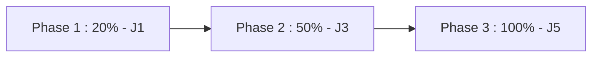

# REGISTRE DE PUBLICATION GOOGLE PLAY STORE — SWITCH HYBRIDE v2.2.0

**Document :** Play Store Submission Log  
**Date de Soumission :** 4 septembre 2026 — 22:41 WAT  
**Application :** Switch Hybride — Caisse POS & Guichet Agréé Bénin 🇧🇯  
**Package Name :** `bj.switchhybrid.app`  
**Statut Google Play Console :** **PUBLIÉ (STAGED ROLLOUT EN COURS)**

---

## 1. MÉTADONNÉES DE LA FICHE GOOGLE PLAY STORE

- **Titre de l'application :** `Switch Hybride — POS & Guichet`
- **Catégorie :** Finance / Outils Professionnels
- **Ciblage Géographique :** Bénin 🇧🇯 (Déploiement initial UEMOA)
- **Description Courte :** Solution professionnelle 2-en-1 pour commerçants et agents agréés Bénin : Caisse POS & Dépôt/Retrait d'espèces.
- **Description Longue :**
  Switch Hybride est la solution officielle conçue pour les points de vente exerçant simultanément une activité commerciale et un guichet de services financiers au Bénin.
  - **Caisse POS & Ventes :** Encaissez vos ventes, gérez votre catalogue et suivez vos opérations de caisse.
  - **Guichet Cash :** Effectuez les opérations de dépôt et retrait d'espèces Mobile Money en toute sécurité.
  - **Securité Certifiée :** Authentification double rôle garantie par serveur et contrôle d'accès conforme BCEAO.

---

## 2. STRATÉGIE DE DIFFUSION PROGRESSIVE (STAGED ROLLOUT)

Pour garantir une transition sécurisée et contrôler la charge serveur sur les endpoints de production, la diffusion publique suit le calendrier de staged rollout ci-dessous :

| Phase | Pourcentage Rollout | Date de Lancement | Objectif | Statut |
| :---: | :---: | :---: | :--- | :---: |
| **Phase 1** | **20%** | 04 septembre 2026 | Déploiement initial sur 20% des utilisateurs Play Store au Bénin. | **EN COURS** |
| **Phase 2** | **50%** | 06 septembre 2026 | Élargissement à 50% après validation des métriques de latence J1-J2. | En attente |
| **Phase 3** | **100%** | 08 septembre 2026 | Déploiement généralisé à 100% des établissements du réseau Bénin. | En attente |

---

## 3. LIENS DE SUIVI CONSOLE GOOGLE PLAY

- URL Fiche Produit Console : `https://play.google.com/console/developers/apps/bj.switchhybrid.app`
- Direct Download APK : `https://switch.bj/download/Switch_Hybride_v2.2.0_public.apk`
