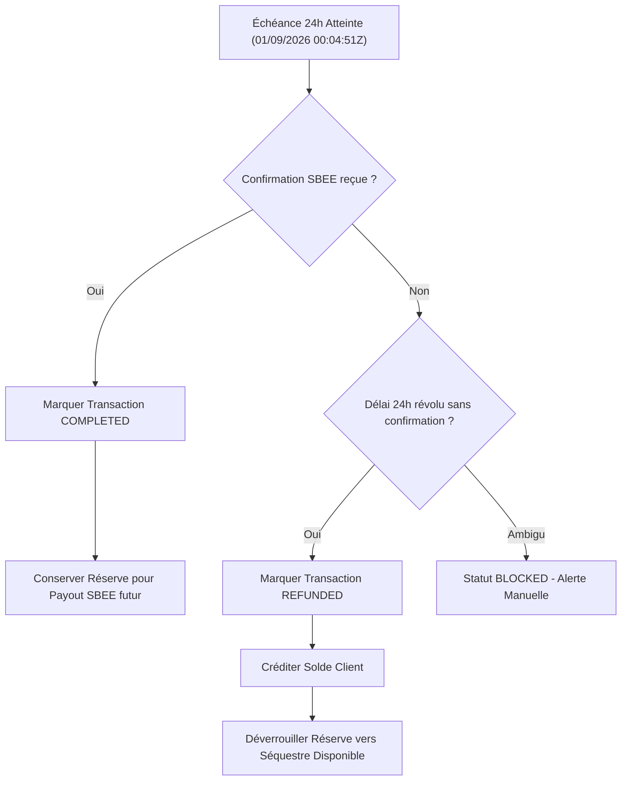

# Checklist Opérationnelle — Fenêtre des 24 Heures (2026-09-01T00:04:51.338Z UTC)

## 1. Principes Directeurs
- **Aucune action automatique non certifiée**.
- **Chaque transaction des 13 est évaluée individuellement**.
- **En cas d'ambiguïté ou d'écart $\rightarrow$ arrêt immédiat avec statut `BLOCKED`**.

## 2. Grille de Qualification Unitaire des 13 Opérations

| Étape de Contrôle | Condition de Validation | Résultat Requis pour Exécution | En Cas d'Échec |
| :--- | :--- | :--- | :--- |
| **1. Horloge Réelle** | `clock_timestamp() >= '2026-09-01T00:04:51.338Z'` | Date serveur PostgreSQL strictement atteinte | Reporter sans modifier |
| **2. Statut Client** | `status = 'processing'` | Transaction toujours en cours | Ignorer / Audit |
| **3. Confirmation SBEE** | Table `bill_provider_confirmations` | Reçue $\rightarrow$ `completed` Absente $\rightarrow$ `refunded` | Si ambigu $\rightarrow$ `BLOCKED` |
| **4. Réserve Dédiée** | Table `escrow_locked_reserves` | `locked = 25 000 FCFA` par transaction | Si non trouvée $\rightarrow$ `BLOCKED` |
| **5. Idempotence** | Table `bill_payment_refunds` | Aucune trace préalable de remboursement | Si déjà traité $\rightarrow$ Skip |
| **6. Parité Séquestre** | `available + locked == 50 000 000 FCFA` | Écart = `0 FCFA` avant et après mutation | Si écart $\neq 0 \rightarrow$ `BLOCKED` |

## 3. Matrice Décisionnelle Finale à la Fenêtre

