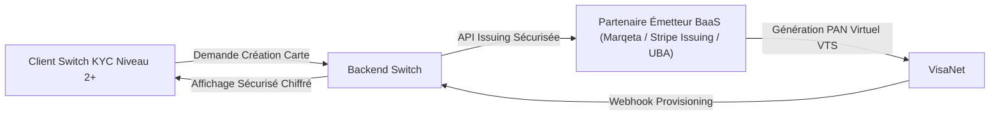

# Dossier Technique d'Intégration Visa — Switch Bénin (Spécification Hors Production)

## 1. Statuts & Avertissements Formels
- **Statut de la Fonctionnalité Visa** : **`VISA_NOT_IMPLEMENTED_OR_NOT_VERIFIED`**
- **Avis Décisionnel** : **`NO-GO (Production & Staging)`**
- **Classification du Simulateur Local** : **`VISA_SIMULATOR_ONLY`**
- **Écrans Frontend (`creer_carte_virtuelle/`, etc.)** : **`MAQUETTES UI UNIQUEMENT`**

---

## 2. Option A : Acceptation de Cartes Visa (Pay-In / Encaissement Client)

```mermaid
graph LR
    A["Client (App / Web)"] -->|Formulaire Sécurisé Hosted / Drop-in| B["PSP Certifié PCI-DSS Level 1"]
    B -->|3-D Secure ACS Challenge| C["Banque Émettrice Visa"]
    C -->|Jeton Tokenisé (Token)| B
    B -->|Webhook Signé HMAC| D["Backend Switch (/api/v1/webhooks/card)"]
    D -->|Crédit Wallet Client| E["PostgreSQL Ledger"]
```

| Composant | Exigence Technique & Recommandation |
| :--- | :--- |
| **Fournisseur / PSP Recommandé** | Cybersource (Visa Solution), Stripe, ou Passerelle Acquéreur UBA Direct. |
| **Acquéreur Nécessaire** | UBA Bénin / Banque Partenaire Agréée BCEAO. |
| **Périmètre PCI-DSS** | **SAQ-A / SAQ-A-EP** : Utilisation d'iFrames sécurisées ou SDK Drop-in pour que le serveur Switch ne touche JAMAIS les numéros de carte (PAN/CVV). |
| **Tokenisation & 3DS** | Tokenisation PCI-DSS (VTS) + Protocole 3-D Secure 2.2 obligatoire (OTP / Biométrie bancaire). |
| **Cycle de Vie des Fonds** | **1. Autorisation** (blocage des fonds) $\rightarrow$ **2. Capture** (débit réel sous 24-48h) $\rightarrow$ **3. Void/Refund** (annulation/remboursement total ou partiel). |
| **Webhooks & Idempotence** | Webhook signé avec secret HMAC, dédoublonnage strict par `event_id` ou `charge_id`. |
| **Réconciliation & Frais** | Rapprochement quotidien entre les captures PSP, les frais d'interchange (1.5% - 2.5%) et le compte de règlement UBA. |

---

## 3. Option B : Émission de Cartes Virtuelles Visa (Issuing / Carte Prépayée)



| Composant | Exigence Technique & Recommandation |
| :--- | :--- |
| **Partenaire BaaS / Émetteur** | UBA Prepaid Card Services, Marqeta, ou Stripe Issuing (agrément émetteur Visa). |
| **Contrats & Régulation** | Agrément émetteur de monnaie électronique BCEAO + Accord BIN Sponsor Visa. |
| **Plafonds & Limites KYC** | Réservé aux profils **KYC Niveau 2 et 3** (plafond max 2 000 000 FCFA / jour). |
| **Sécurité d'Affichage** | Chiffrement E2E des PAN/CVV lors de l'affichage dans l'écran mobile via module sécurisé. |
| **Compte de Cantonnent Float** | Réserve séquestre dédiée alimentée 1:1 pour couvrir les autorisations de dépenses en temps réel. |

---

## 4. Variables d'Environnement Requises (Hors Production)

```env
# CONFIGURATION VISA SANDBOX (EXEMPLE HORS PRODUCTION)
VISA_SANDBOX_PSP_PROVIDER=CYBERSOURCE_OR_UBA_SANDBOX
VISA_SANDBOX_MERCHANT_ID=test_merchant_switch_benin
VISA_SANDBOX_API_KEY=test_api_key_sandbox_only
VISA_SANDBOX_SHARED_SECRET=test_shared_secret_sandbox_only
VISA_SANDBOX_WEBHOOK_SECRET=test_webhook_hmac_secret_only
```

---

## 5. Plan de Rollback & Critères de Déploiement

1. **Rollback Immédiat** : Désactivation du toggle `CARD_PAYMENTS_ENABLED = false` dans `system_features`.
2. **Critères GO / NO-GO pour Passage en Production** :
   - Contrat signé avec le PSP/Acquéreur bancaire.
   - Validation de l'attestation de conformité PCI-DSS SAQ-A.
   - Validation des tests de charge et webhooks sur passerelle sandbox officielle.
   - Approbation formelle de la direction financière.
